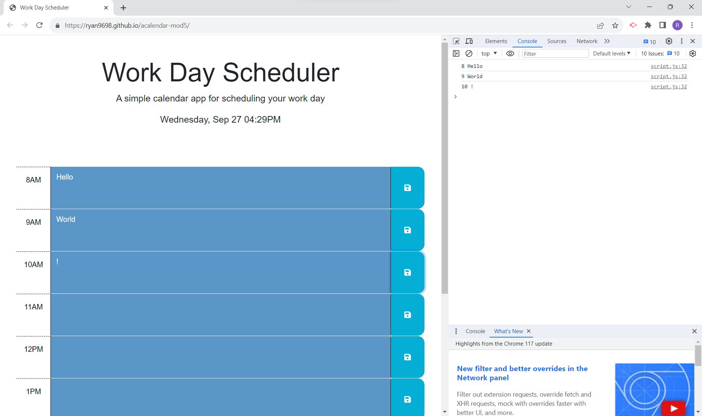
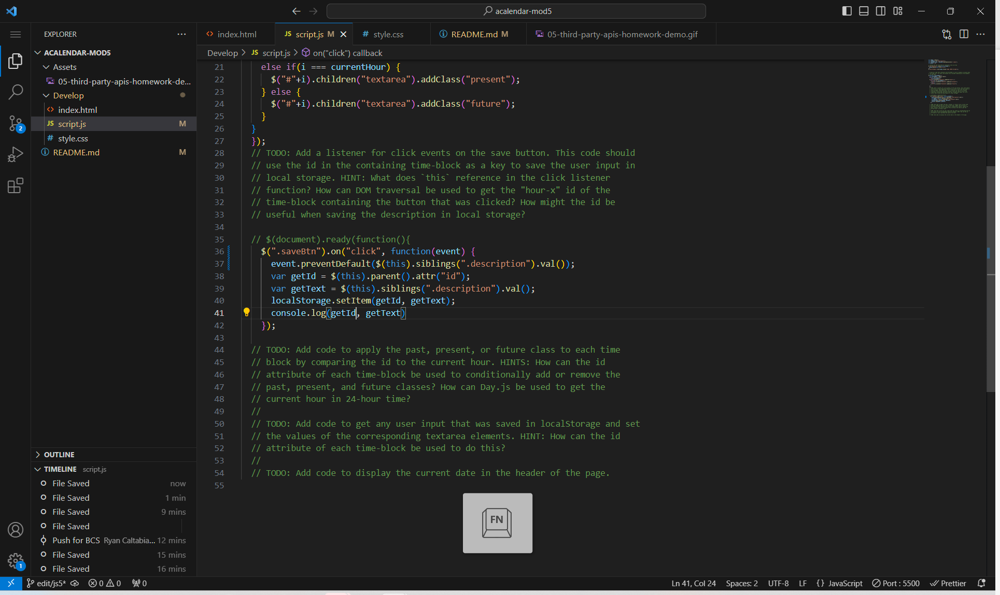

# Module 4 Challenge: Workday Planner

## Description

This app was designed to be a workday planner in which the user can input the information they 
need in the appropriate text boxes and save them to local storage in order to be pulled up again
at a later time. A user can quickly discern where to place data by the colors of the text areas.
Blue signifies that the hour has already passed, red is the current hour we are in, and green is
used for future appointments. The schedule is based on an average workday of 8AM-5PM. 
 
The website will save the information put into the text fields by clicking the
save button and will remain in the boxes until changed. In order to change the text, a user only
needs to overwrite the text and click the save button again.

Like the previous projects we have worked on, I gained a great deal of knowledge with the new 
concepts that were introduced. I learned the effectiveness of jQuery and how to utilize dayjs
in a practical way. I also gained new experience with loops and some of the different ways they
can be applied as well as how you can utilize ids in HTML with loops. 

## Installation

N/A

## Usage

To use the app, a user only needs to type in the information they want into the appropriate time
window and click the save button. The data will be saved to local storage and the user can pull
up the page to see the information at any point. They can exit the page and revisit it to still
see the information.

## Credits

The files necessary for this project were pulled from The Coding Bootcamp's GitHub respository.
All HTML and CSS were provided by the repository. Only minor edits were made
to these two files. JavaScript files were made
https://github.com/coding-boot-camp/crispy-octo-meme

## License

Please refer to the LICENSE in the repo.

## Link: https://ryan9698.github.io/acalendar-mod5/

## Screenshot of live deployment

## Screenshot of JavaScript

